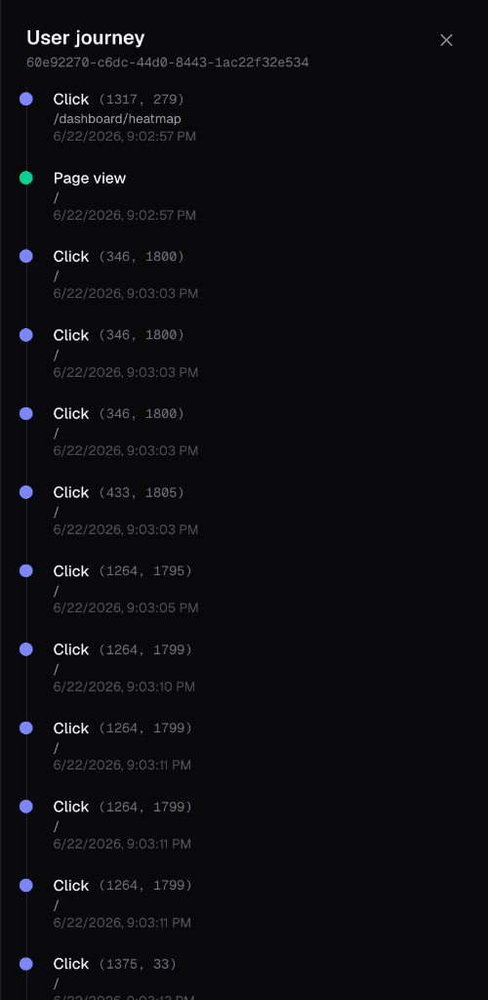
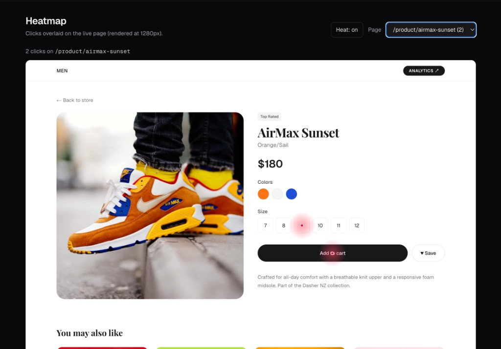

# User Analytics

A tiny full-stack app that **tracks clicks and page views** on a live storefront
and visualizes them as **session journeys** and a **click heatmap**.

One Next.js app. One MongoDB collection. Zero-config tracker script.

---

## The flow (proof)

**1. User browses the store** → tracker script captures every `page_view` and `click`.

**2. Dashboard → Sessions** opens the full user journey, in order, with coordinates.



**3. Dashboard → Heatmap** overlays those clicks back on the live page.



That is the whole loop: **browse → ingest → replay**.

---

## Stack

| Layer    | Choice                                          |
| -------- | ----------------------------------------------- |
| App      | Next.js 16 (App Router) · React 19 · TS · Tailwind v4 |
| API      | Next.js Route Handlers (`app/api/*`)            |
| Database | MongoDB                                         |
| Tracker  | Vanilla JS (`public/tracker.js`) — no deps      |

> One repo, one deploy. Storefront, API, and dashboard ship together; shared types end-to-end.

---

## Quick start

```bash
pnpm install
cp .env.example .env.local        # set MONGODB_URI
pnpm dev                          # http://localhost:3000
```

Optional local Mongo:

```bash
docker run -d -p 27017:27017 --name analytics-mongo mongo:7
curl http://localhost:3000/api/health   # { "status":"ok", "db":"connected" }
```

| Env                    | Required | Default           |
| ---------------------- | -------- | ----------------- |
| `MONGODB_URI`          | yes      | —                 |
| `MONGODB_DB`           | no       | `user_analytics`  |
| `NEXT_PUBLIC_API_BASE` | no       | same-origin       |

---

## Try it

1. Open **`/`** — the storefront. Click around, view a product, add to cart.
2. Open **`/dashboard`** — your session appears with click + page-view counts. Hit **View journey**.
3. Open **`/dashboard/heatmap`** — pick a page from the dropdown, see your clicks.

---

## API

All under `app/api`. Ingest is CORS-open so the tracker works from any origin.

| Method | Endpoint                  | Purpose                                            |
| ------ | ------------------------- | -------------------------------------------------- |
| POST   | `/api/events`             | Ingest one event or a batch (max 100)              |
| GET    | `/api/sessions`           | All sessions + counts, newest first                |
| GET    | `/api/sessions/[id]`      | Ordered events for one session (the journey)      |
| GET    | `/api/heatmap?path=...`   | Click coordinates for a page                       |
| GET    | `/api/pages`              | Pages that have clicks (heatmap selector)          |
| GET    | `/api/health`             | DB connectivity check                              |

```bash
curl -X POST http://localhost:3000/api/events \
  -H 'Content-Type: application/json' \
  -d '{"sessionId":"abc","type":"click","url":"http://x/p","timestamp":"2026-01-01T00:00:00Z","x":10,"y":20}'
```

---

## Tracker

Drop on any page:

```html
<script src="/tracker.js" data-endpoint="/api/events"></script>
```

Generates a `session_id` (localStorage + cookie fallback), batches events,
flushes on a timer and on page-hide via `sendBeacon`. In this app it's mounted
via `app/components/Tracker.tsx` so SPA route changes also emit `page_view`.

---

## Data model

Single `events` collection:

| Field        | Type                        | Notes                              |
| ------------ | --------------------------- | ---------------------------------- |
| `sessionId`  | string                      | Client cookie/localStorage         |
| `type`       | `page_view` \| `click`      |                                    |
| `url`, `path`| string                      | `path` is the heatmap grouping key |
| `timestamp`  | Date                        | Client time                        |
| `x`, `y`     | number                      | Document-relative (clicks only)    |
| `receivedAt` | Date                        | Server time                        |

Indexes: `{ sessionId, timestamp }` for journeys, `{ path, type }` for heatmaps.

---

## Layout

```
app/
  (store)/            storefront — what gets tracked
  dashboard/          analytics — not tracked
  api/                ingest + read endpoints
  components/         Tracker, Nav, ProductCard, ...
lib/                  mongodb, events, http, products
public/tracker.js     drop-in tracking script
types/analytics.ts    shared event/session types
```

## Trade-offs

- **Single app**, not microservices — fastest path; API is coupled to Next.js.
- **Anonymous sessions** — no auth, identity is the client-generated `sessionId`.
- **Document-relative coordinates** — heatmap renders at the page's own width.
